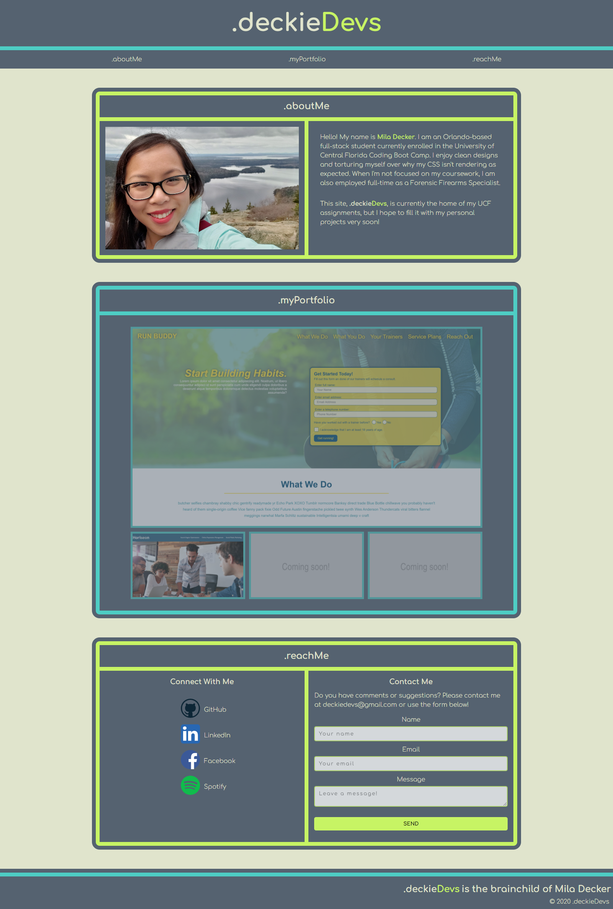

# .deckieDevs

## Purpose
deckieDevs is Mila Decker's web development portfolio.  On October 8, 2020, Mila enrolled in the University of Central Florida Coding Boot Camp. The portfolio currently showcases the assignments she has completed as a UCF Boot Camp student.  The website itself is an application of the knowledge that she has gained throughout the program.  Soon, deckieDevs will be filled with Mila's own personal projects and applications.

## Contents
1. [Built With](#built-with)
2. [Features](#features)
3. [Website](#website)
4. [Task List](#task-list)
5. [Contribution](#contribution)

## Built With
* HTML
* CSS
* JavaScript

## Features
As of initial deployment on October 23, 2020, deckieDevs features:

* CSS Flexboxes
* CSS Grids
* CSS Transitions
* Media Query Responsiveness

deckieDevs is best enjoyed on a web browser, but is adaptable to mobile screens!

## Website

[Deployed .deckieDevs Web Page](https://deckiedevs.github.io)

## Task List
- [x] Review/refactor code
- [x] Learn and apply JavaScript
- [ ] Revamp deckieDevs with new technologies!

## Contribution
* .deckieDevs was made with love by Mila Decker.
* Contact form powered by [Formspree](https://www.formspree.io)
* Color scheme inspired by [COLOURLovers](https://www.colourlovers.com)
* Social media icons provided by [ICONFINDER](https://www.iconfinder.com/social-media-icons)