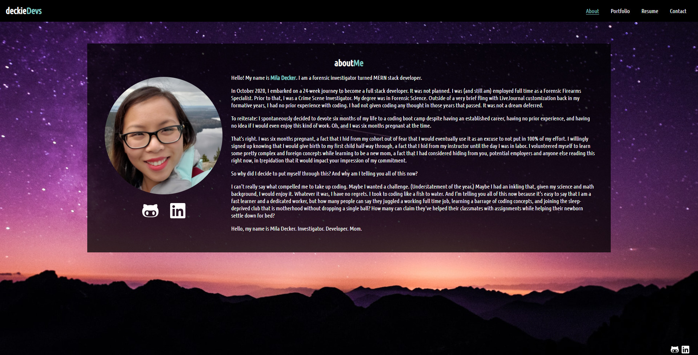

# deckieDevs

## Purpose
deckieDevs is Mila Decker's web development portfolio.  It includes assignments from her University of Central Florida boot camp as well as personal projects.

## Contents
1. [Built With](#built-with)
2. [Technologies](#technologies)
3. [Website](#website)
4. [Task List](#task-list)
5. [Contribution](#contribution)

## Built With
* React
* JavaScript
* HTML
* CSS

# Technologies
* Portfolio animations by [React Animate On Scroll](https://www.npmjs.com/package/react-animate-on-scroll) and [Animate.css](https://animate.style/)
* Contact form powered by [Formspree](https://www.formspree.io)
* Icons from [FontAwesome](https://fontawesome.com/)

## Website

[Deployed deckieDevs Web Page](https://deckiedevs.github.io)
## Credits
* deckieDevs was made with love by Mila Decker.